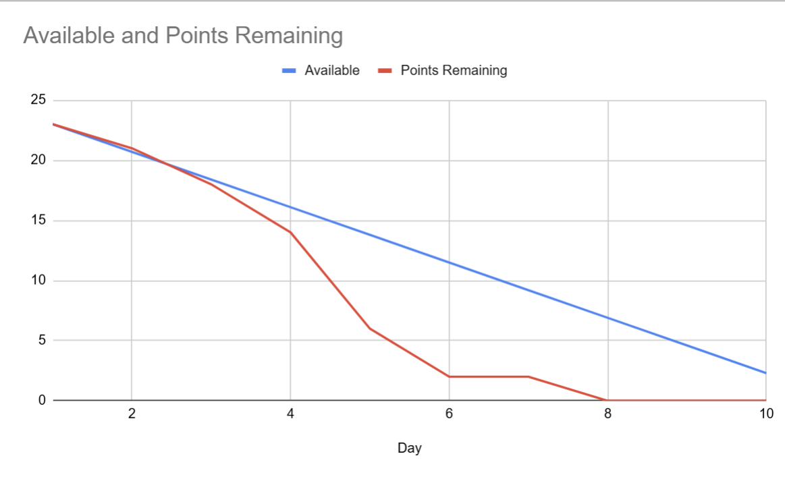
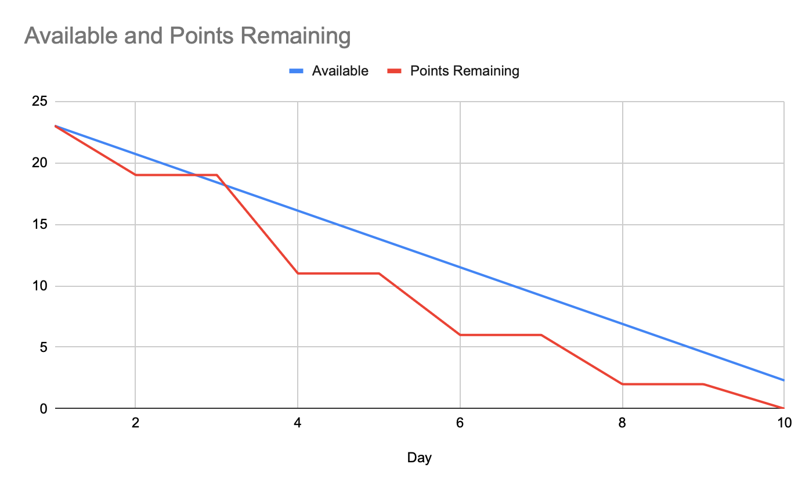
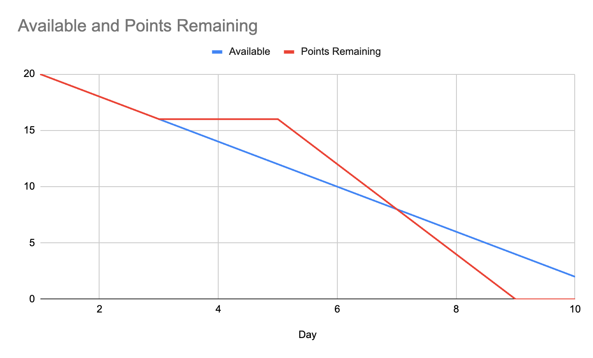
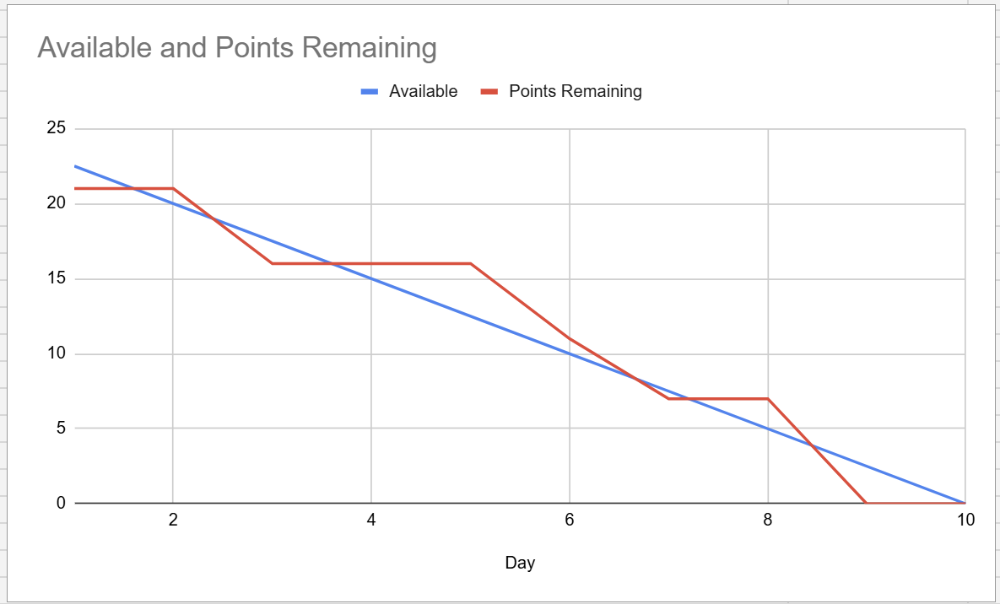

# Dublin Bikes — Final Project Report

---

## Title Page

**Project:** Dublin Bikes Usage Prediction & Journey Planning Web Application

**Authors and Contributions**

| Name | Contribution (%) | Type of Contribution |
|------|-----------------|----------------------|
| Kaiwen Yao | 33% | Code (frontend — React UI, map, chat, auth; backend — Flask architecture, prediction integration, JWT auth, DB design, CI/CD), Report |
| Tzuyu Chang | 33% | Code (backend — station/weather/journey APIs, scraper; ML pipeline), Report |
| Ziling Huang | 33% | Code (backend — user auth, chat service, DB migrations; testing), Report, Management |

**Video Recording URL:** _(6–8 minute screen recording — to be inserted)_

**GitHub Project URL:** _(to be inserted)_

**Product & Sprint Backlog URL:** _(to be inserted)_

**Generative AI Chat Documents:**
- Kaiwen Yao: [`KaiwenYao_Generative_AI_chats.md`](./KaiwenYao_Generative_AI_chats.md)
- Tzuyu Chang: [`TzuyuChang_Generative_AI_chats.md`](./TzuyuChang_Generative_AI_chats.md)
- Ziling Huang: [`ZilingHuang_Generative_AI_chats.md`](./ZilingHuang_Generative_AI_chats.md)

---

## 1. Overview

### 1.1 Project Objectives

The Dublin Bikes project aims to provide users with a data-driven web application that addresses the core frustrations of the Dublin Bikes sharing scheme: arriving at an empty station, failing to find a free docking stand, and being caught unprepared by the city's unpredictable weather. The application:

- Displays **real-time bike station availability** on an interactive Google Maps interface.
- Provides **machine-learning powered predictions** of future bike availability at each station for up to 48 hours ahead.
- Integrates **live and forecast weather data** to help users decide when to cycle.
- Offers a **smart journey planner** that calculates the optimal start and end stations for a trip using walking and cycling times.
- Provides a **GenAI-powered chatbot** for natural-language queries about the system and city.
- Supports **user accounts** with secure registration, email verification, JWT-based authentication, and persistent chat history.

### 1.2 Target Users

Three primary user archetypes were identified and validated through interviews conducted during Sprint 1:

**Eoin — The Daily Student Commuter.** A budget-conscious UCD Computer Science student who cycles daily. He needs to know whether a bike will be available at his station before he leaves his apartment, and whether the destination station will have a free docking slot.

**Sarah — The Punctual Office Worker.** A professional commuting to the Silicon Docks via a "last mile" city bike. She values planning ahead and needs the fastest route with confidence that she can dock on arrival.

**Matteo — The Weekend Tourist.** A visitor unfamiliar with Dublin's layout. He needs a simple, visual map interface and a chatbot he can ask questions such as "Where is the nearest station to Temple Bar?"

### 1.3 Main Features

| Feature | Description |
|---------|-------------|
| Live Station Map | Google Maps interface showing all Dublin Bikes stations with real-time available bike and stand counts on hover |
| ML Availability Prediction | 48-hour forecast of available bikes per station, powered by a Random Forest model trained on historical data |
| Weather Integration | Current and forecast weather conditions displayed on the map and home page |
| Smart Journey Planner | Finds optimal pickup and drop-off stations given a start and end address or coordinates |
| GenAI Chatbot | Streaming LLM-backed assistant with persistent chat session history |
| User Accounts | Registration, email verification, JWT login, refresh tokens, profile management |

_(Main screenshot of the final app — to be inserted)_

---

## 2. Requirements

### 2.1 Requirements Elicitation Process

Requirements elicitation followed a **user-centred process** combining competitive analysis, persona development, and in-person semi-structured interviews.

**Step 1 — Competitive Analysis.** During Sprint 1 we surveyed five comparable bike-sharing systems across Europe (Dublin Bikes / JCDecaux, Villo! in Brussels, Vélib' in Paris, Bicing in Barcelona, Santander Cycles in London). The analysis identified a clear gap: no existing tool in Dublin offered predictive availability — only live snapshots. This gap became the primary differentiation of our project.

| Feature | Our App | JCDecaux Official | Vélib' (Paris) | Bicing (Barcelona) |
|---------|---------|-------------------|----------------|--------------------|
| Availability Logic | **Predictive (ML)** | Real-time only | Real-time + heatmap | Probability-based |
| UI (Map) | Google Maps + custom pins | Basic pins | Dual-pin system | Integrated mobility |
| Unique Value | ML prediction prevents "empty station" surprise | Hardware integration | Battery monitoring | Gamification |

**Step 2 — Persona Development.** Based on the competitive analysis and domain knowledge, three user personas were defined to represent the primary target audiences and focus subsequent research.

**Step 3 — User Interviews.** Semi-structured interviews were conducted with three participants representing each persona. Key validated pain points:
- Sarah and Eoin both described the frustration of arriving at an empty station and having to take a taxi or walk.
- Matteo spent 30 extra minutes finding an alternative station after his first choice was empty.
- All three interviewees rated weather information as a critical input to their decision to rent a bike.
- Sarah and Eoin rated parking assurance 8/10 and "extremely important" respectively.

The interviews confirmed that **real-time availability**, **predictive forecasting**, **weather integration**, and **station parking assurance** are the highest-priority features.

### 2.2 Mockups

Mockups were developed in Figma during Sprint 1 and presented at the Sprint 1 Review. The most relevant mockup is available at [`requirements/Mockup_V1.1.pdf`](./requirements/Mockup_V1.1.pdf). Key screens include: the home/map page, station detail popover, journey planner input panel, chat interface, and login/registration flow.

Additional elicitation material — interview transcripts, personas, and competitive analysis — is available in the [`requirements/`](./requirements/) folder.

### 2.3 User Stories and Acceptance Criteria

**US-01 — Real-Time Station Availability**
> As a daily commuter, I want to see the current number of available bikes and free stands at every station on a map, so that I can choose the right station before leaving home.

| # | Acceptance Criterion |
|---|----------------------|
| AC-01a | All stations appear as markers on the Google Maps view within 3 seconds of page load. |
| AC-01b | Hovering over a station marker displays its current available bike count and free stand count without additional interaction. |
| AC-01c | Data shown is no more than 5 minutes old (reflecting the scraper interval). |

**US-02 — Bike Availability Prediction**
> As a student commuter, I want to see a forecast of bike availability for my preferred station up to 48 hours ahead, so that I can plan my journey before leaving my apartment.

| # | Acceptance Criterion |
|---|----------------------|
| AC-02a | Clicking a station marker opens a panel showing a time-series chart of predicted available bikes. |
| AC-02b | Predictions are available for at least 24 hours into the future when weather forecast data is present. |
| AC-02c | Predictions are clipped to the valid range [0, station capacity] and returned in whole numbers. |

**US-03 — Weather Integration**
> As a cyclist, I want to see current and forecast weather conditions alongside station data, so that I can make a go/no-go decision before committing to a ride.

| # | Acceptance Criterion |
|---|----------------------|
| AC-03a | Weather information (temperature, wind, rain, description) is displayed on the home/map page. |
| AC-03b | A weather forecast for at least 6 hours is available. |
| AC-03c | Weather data refreshes automatically without requiring a page reload. |

**US-04 — Smart Journey Planner**
> As an office worker, I want to enter my start and end addresses and receive a recommended cycling route with optimal pick-up and drop-off stations, so that I can minimise total travel time.

| # | Acceptance Criterion |
|---|----------------------|
| AC-04a | Accepts either free-text addresses or map coordinates as input. |
| AC-04b | Displays the recommended start station (with available bikes) and end station (with free stands). |
| AC-04c | Renders the walking-cycling-walking route as three coloured polyline segments on the map. |
| AC-04d | Returns a meaningful error message if no suitable stations are found. |

**US-05 — GenAI Chatbot**
> As a tourist, I want to ask natural-language questions about the Dublin Bikes system, so that I can get help without needing to navigate complex menus.

| # | Acceptance Criterion |
|---|----------------------|
| AC-05a | The chat interface streams the AI response word-by-word. |
| AC-05b | Chat sessions are persisted so that conversation history is available after login. |
| AC-05c | The chatbot is only accessible to authenticated users. |

**US-06 — User Accounts**
> As a returning user, I want to register with an email address, verify my account, and log in securely, so that my chat history and preferences are saved.

| # | Acceptance Criterion |
|---|----------------------|
| AC-06a | Registration requires a valid email, username, and password. |
| AC-06b | A verification email is sent upon registration; the account is activated via a link or a code. |
| AC-06c | Login returns an access token and a refresh token; the session is maintained via interceptor-based token refresh. |
| AC-06d | Logout invalidates the server-side token version, preventing token reuse. |

---

## 3. Architecture and Design

### 3.1 Overall System Architecture

The application is split into three independently deployable components, all hosted on an **AWS EC2** instance and sharing a single **AWS RDS (MySQL)** database:

```
┌─────────────────────────────────────────┐
│  External Sources                       │
│  JCDecaux API     OpenWeatherMap API    │
└──────┬───────────────────┬──────────────┘
       │                   │
┌──────▼───────────────────▼──────────────┐
│  scraper/ (Python – background process) │
│  JCDecaux Scraper   Weather Scraper     │
└─────────────────────┬───────────────────┘
                      │ writes
             ┌────────▼────────┐
             │  AWS RDS MySQL  │
             └────────┬────────┘
                      │ reads
┌─────────────────────▼───────────────────┐
│  flask-app/ (Gunicorn – REST API)       │
│  Stations  Availability  Prediction     │
│  Weather   Journey  Auth  Chat (SSE)    │
└─────────────────────┬───────────────────┘
                      │ /api
┌─────────────────────▼───────────────────┐
│  react-app/ (nginx – SPA)               │
│  Map  Journey  Chat  Auth  Profile      │
└─────────────────────────────────────────┘
        ▲
        │  Interacts
     Web User
```

The three repositories — **flask-app**, **react-app**, and **scraper** — each have their own Jenkins CI/CD pipeline that builds, tests, and deploys Docker containers to EC2 automatically on merge to `main`.

### 3.2 Class Diagram

The web application is structured around three subsystems. Key classes and their relationships:

**Scraper Subsystem**
- `FetchStations` polls JCDecaux and persists `Station` and `Availability` records.
- `FetchWeather` polls OpenWeatherMap and persists `WeatherForecast` records.
- Both use `DatabaseManager` for persistence.

**Flask App Subsystem (Models → Services → Controllers)**
- **Domain Entities:** `Station`, `Availability`, `WeatherForecast`, `User`, `Session`, `ChatHistory`.
- **Services:** `StationService`, `PredictionService`, `WeatherService`, `JourneyService`, `UserService`, `ChatService`.
- **API Controllers (Blueprints):** `StationRoutes`, `WeatherRoutes`, `JourneyRoutes`, `UserRoutes`, `ChatRoutes`.

**React Frontend Subsystem (Pages)**
- `SearchMapsPage`, `ChatPage`, `LoginPage`, `RegisterPage`, `VerifyEmailPage`, `ProfilePage`, `HomePage`.

Key structural relationships:
- `User` (1) owns `Session` (0..*), each `Session` contains `ChatHistory` (0..*).
- `Station` (1) aggregates `Availability` (0..*).
- `PredictionService` depends on both `Station` (spatial features) and `WeatherForecast` (meteorological features).

Full PlantUML source: [`UML_files/2_Web_Application_Class_Diagram.txt`](./UML_files/2_Web_Application_Class%20_Diagram.txt)

### 3.3 Sequence Diagrams

**User Login and Session Creation**

```
Web User → LoginPage → UserRoutes.login() → UserService.login_user()
         → DB: query User by email
         → UserService: verify password hash
         → UserService: create_access_token() + create_refresh_token()
         → API: return auth_tokens JSON
         → LoginPage: navigate to App Dashboard
```

The access token has a short expiry; the React axios interceptor transparently refreshes it using the refresh token before any authenticated API call.

Full PlantUML source: [`UML_files/3_User_Login_and_Session_Creation.txt`](./UML_files/3_User_Login_and_Session_Creation.txt)

**Journey Planner**

```
Web User → SearchMapsPage → JourneyRoutes.plan_journey()
         → JourneyService.find_best_route()
         → DB: fetch active Station + Availability
         → JourneyService: filter closest operative stations
         → Google Maps Distance Matrix API: walking durations
         → Google Maps Distance Matrix API: cycling durations
         → JourneyService: minimise total_time (Walk + Cycle + Walk)
         → API: best_route JSON
         → SearchMapsPage: render three-segment polyline
```

Full PlantUML source: [`UML_files/4_Journey_Planner.txt`](./UML_files/4_Journey_Planner.txt)

**AI Chatbot Interaction**

```
Web User → ChatPage → ChatRoutes (auth check)
         → ChatService.generate_chat_stream()
         → DB: find or create Session
         → DB: write user message to ChatHistory
         → DB: load session history context
         → LLM Provider (Aliyun Qwen): streaming request
         → DB: write LLM response to ChatHistory
         → API: SSE stream → ChatPage: typewriter display
```

Full PlantUML source: [`UML_files/5_AI_Chatbot.txt`](./UML_files/5_AI_Chatbot.txt)

**Bike Availability Prediction Pipeline**

```
Web User → SearchMapsPage → StationRoutes.get_station_prediction()
         → PredictionService.get_station_predictions()
         → WeatherService: query WeatherForecast from DB
         → PredictionService: construct 11-feature DataFrame
         → RandomForestRegressor.predict() (pre-loaded at startup)
         → API: prediction array JSON (forecast_time + predicted_bikes)
         → SearchMapsPage: render Recharts time-series chart
```

Full PlantUML source: [`UML_files/6_Bike_Availability_Prediction.txt`](./UML_files/6_Bike_Availability_Prediction.txt)

### 3.4 Database Design

The database schema is owned by **flask-app** Flask-Migrate (Alembic) migrations. All tables are defined in SQLAlchemy ORM models; the scraper only writes data and never modifies the schema.

| Table | Primary Key | Key Columns | Design Rationale |
|-------|-------------|-------------|-----------------|
| `station` | `number` (INT, JCDecaux ID) | `name`, `address`, `pos_lat`, `pos_lng`, `banking`, `bike_stands` | Static metadata; JCDecaux `number` as natural PK avoids a surrogate key. |
| `availability` | `id` (INT, auto) | `station_number` (FK), `timestamp`, `available_bikes`, `available_bike_stands`, `status` | Append-only log; FK to `station.number`. Scraped every 5 minutes. |
| `weather_forecast` | `id` (INT, auto) | `forecast_time` (upsert key), `temp`, `wind_speed`, `rain`, `description` | Upserted hourly; rows beyond 48 hours ahead are pruned automatically. |
| `user` | `id` (INT, auto) | `username` (UNIQUE), `email` (UNIQUE), `password_hash`, `is_active`, `token_version` | `token_version` enables server-side logout (bumped on each logout). |
| `sessions` | `id` (VARCHAR 64, UUID) | `user_id` (FK), `title`, `created_at`, `updated_at` | Supports LangChain `SQLChatMessageHistory`; title auto-generated from the first message. |
| `message_store` | `id` (INT, auto) | `session_id` (FK), `message` (JSON) | JSON field stores both role and content in LangChain message format. |

**Entity Relationship Summary:**
- `station` (1) → `availability` (0..*): one station has many availability snapshots.
- `user` (1) → `sessions` (0..*) → `message_store` (0..*): hierarchical ownership of chat history.

Full PlantUML source: [`UML_files/7_Entity_Relationship.txt`](./UML_files/7_Entity_Relationship.txt)

**Key Design Choices:**
1. **Schema-first via Flask-Migrate:** Alembic-backed migrations prevent version drift in collaborative development and provide an auditable schema history.
2. **RDS migration (Sprint 3):** The MySQL instance was moved from a Docker container on EC2 to AWS RDS after accumulated availability data caused query timeouts. RDS provides managed performance, automated backups, and connection pooling.
3. **Separate scraper process:** Ingestion is decoupled from the API to avoid blocking web requests during scrape operations and to allow independent scaling.

---

## 4. Machine Learning Model

### 4.1 Selected Features, Feature Extraction, and Target Variable

**Target variable:** `num_bikes_available` — the integer number of bikes rentable at a station at a given future time. The task is framed as **supervised regression**.

**Raw data:** `final_merged_data.csv` — 298,946 rows and 78 columns — formed by joining historical JCDecaux availability snapshots with hourly Met Éireann weather observations (December 2024). The dataset contains no missing values.

**Data cleaning:** The following column groups were removed systematically:

| Removed Group | Reason |
|---------------|--------|
| `*_quality_indicator` columns | Metadata flags; no meteorological signal |
| `*_std_deviation` columns | Redundant given min/max columns |
| Soil / grass / earth temperature columns | Very low correlation with urban bike usage |
| Text columns (`name`, `address`, `last_reported`) | Not numeric; location already encoded by coordinates |
| Near-constant booleans (`is_installed`, `is_renting`, `is_returning`) | Near-zero variance; no discriminative power |

After pruning, 15 columns remained. Five additional features were engineered:

| Derived Feature | Construction |
|-----------------|--------------|
| `day_of_week` | Integer 0 (Mon) – 6 (Sun) extracted from the date |
| `is_weekend` | Binary flag (1 = Saturday or Sunday) |
| `avg_temperature` | Mean of `max_air_temperature_celsius` and `min_air_temperature_celsius` |
| `avg_humidity` | Mean of max and min relative humidity |
| `avg_pressure` | Mean of max and min barometric pressure |

`month` and `year` were dropped as zero-variance columns (single-month dataset).

**Final 11 input features:** `station_id`, `capacity`, `lat`, `lon`, `hour`, `day`, `day_of_week`, `is_weekend`, `avg_temperature`, `avg_humidity`, `avg_pressure`.

### 4.2 Training and Testing Process

**Train–test split:** 70% training / 30% testing with `random_state=42` → 209,262 training rows and 89,684 test rows.

**Candidate models:**
1. Linear Regression (baseline)
2. Decision Tree Regressor
3. Random Forest Regressor (`n_estimators=100`, `max_depth=15`, `min_samples_leaf=10`)
4. Gradient Boosting Regressor (default configuration)

**Evaluation metrics:** Mean Absolute Error (MAE), Root Mean Squared Error (RMSE), Coefficient of Determination (R²).

### 4.3 Results and Reflection

| Model | MAE | RMSE | R² |
|-------|-----|------|----|
| Linear Regression | 7.829 | 9.366 | 0.075 |
| Decision Tree | 0.970 | 2.376 | 0.941 |
| **Random Forest** | **2.325** | **3.393** | **0.879** |
| Gradient Boosting | 6.120 | 7.537 | 0.401 |

Linear Regression (R² ≈ 0.08) fails to capture non-linear relationships between time, location, and bike demand. Gradient Boosting under-performs under its default shallow-tree configuration. The Decision Tree achieves the best test-set numbers but is more susceptible to over-fitting. The **Random Forest** was selected for production for its greater stability and generalisation to unseen days and weather conditions.

**Feature importance (Random Forest built-in `feature_importances_`):**
1. `lat` / `lon` — neighbourhood demand patterns dominate.
2. `day` / `hour` — commuting cycles.
3. `station_id` — location-specific baseline beyond coordinates.
4. `avg_pressure` — strongest weather signal.
5. `capacity` — sets the availability ceiling.
6. `day_of_week` / `avg_temperature` — moderate contributors.
7. `avg_humidity` / `is_weekend` — smaller but non-negligible.

**Production integration:** The trained model and feature list are serialised as `bike_availability_model.pkl` and `model_features.pkl`. At Flask startup, `prediction_service._load_model()` pre-warms both into module-level globals so request-path inference requires no disk I/O — only one batched `model.predict()` call per station lookup. Outputs are rounded and clamped to `[0, station.bike_stands]`.

**Limitations:**
- Training data covers only December 2024; seasonal effects (summer tourism, university terms) are not captured.
- Production inference uses OpenWeatherMap hourly point forecasts under the `avg_*` feature names trained on Met Éireann daily min/max aggregates — a provider and granularity mismatch that may cause prediction drift.

**Future improvements:** Expand to 6–12 months of data; add lag features (t−1h, t−24h, t−7d); hyper-parameter tuning with grid search; provide prediction intervals rather than point estimates.

---

## 5. Testing

### 5.1 Backend (flask-app)

**Framework:** pytest with JUnit XML output (`pytest tests/ --junitxml=test-reports/pytest.xml`).

**Strategy:** An SQLite in-memory database is created per test run. All external service calls — Google Maps API, LLM (Aliyun Qwen), Flask-Mail — are mocked in `conftest.py` and individual test modules, isolating tests from network availability and cost.

**Coverage achieved:** Approximately **97% statement coverage** on the `app` package (`pytest --cov=app`), as reported by the CI pipeline.

**Test scope:** Station retrieval and availability endpoints; ML prediction service (feature construction, output clamping, error paths); user registration, email verification, login, JWT token refresh and logout; journey planning with mocked Distance Matrix responses; chat session creation and history retrieval; weather forecast reading.

**AI-assisted report–code consistency check:** The report's API descriptions (request/response shapes, error codes) were verified against the actual Flask route implementations using Generative AI tooling. Discrepancies identified in early drafts were corrected prior to final submission. This process is documented in [`KaiwenYao_Generative_AI_chats.md`](./KaiwenYao_Generative_AI_chats.md).

### 5.2 Frontend (react-app)

**Static analysis in CI:** `npm run lint` (ESLint) and `npx tsc --noEmit` (TypeScript type-checking) are executed in the Jenkins pipeline on every commit, before the Docker image is built. These gates catch type errors and style violations before any code reaches EC2.

**AI-assisted markdown formatting:** Documentation files produced with AI tooling were reviewed for structural correctness — valid headers, consistent table alignment, correct code blocks. Usage is logged in each team member's AI chat file.

### 5.3 Scraper

`py_compile` is run on all core Python modules in the Jenkins pipeline after dependency installation. This syntax gate prevents a broken scraper image from being pushed or deployed.

### 5.4 Manual / System Testing

End-to-end journeys were validated manually on the deployed EC2 application at each Sprint Review. Scenarios covered: new user registration and email activation; login and protected chat session access; journey planning between two Dublin addresses; real-time station hover display; bike availability prediction chart for a selected station.

---

## 6. Process

### 6.1 Project Organisation and Management

The work is distributed across **three Git repositories**:

| Repository | Role |
|------------|------|
| **flask-app** | REST API backend (auth, stations, weather, predictions, journey, chat). Owns the database schema via Flask-Migrate. |
| **react-app** | Single-page React frontend (React 19, TypeScript, Vite 7, Tailwind CSS 4). Served in production by nginx. |
| **scraper** | Background data ingestion — JCDecaux availability polling and OpenWeatherMap weather fetching. |

**Tools adopted:**
- **Version control:** Git with a **feature branch workflow** — all work is done on a named branch and merged via pull request after review.
- **CI/CD:** Jenkins Pipeline with a Kubernetes agent (Python or Node builder + Docker CLI sidecar) per repository. On merge to `main`, the pipeline builds a Docker image, pushes it to Docker Hub, and deploys to EC2 via SSH.
- **Database:** AWS RDS (MySQL). Schema managed by flask-app Flask-Migrate; the scraper writes via SQLAlchemy.
- **Containerisation:** Docker for both local development and production; all containers share a `flask-app` Docker network on EC2.
- **Communication:** Discord for daily async updates; sprint ceremonies conducted in team meetings.
- **Project tracking:** Product and sprint backlogs at the URL provided on the title page.

### 6.2 Sprint Narratives

#### Sprint 1 — Requirements Engineering & Data Collection

**Features completed and key technical choices:**

1. **User Research:** Three personas defined and interviews conducted to validate assumptions. The tourist's fear of getting lost prompted a **hover / click distinction** on map markers — hover for quick stats, click for detailed status.
2. **Project Planning & Design:** User stories, UI mockups (Figma), and acceptance criteria produced to guide future sprints.
3. **Technical Infrastructure:** MySQL database set up; Python scraping scripts for JCDecaux and OpenWeather developed and deployed.
4. **Design Decision — Scrape Interval:** Set to **5 minutes**, balancing data granularity against JCDecaux API rate limits and storage efficiency.

**Burndown chart:**



The "Actual Remaining Effort" dropped below the "Ideal Trend" line around Day 4, reaching zero two days before the sprint deadline. The resulting capacity was used for backlog refinement and Journey Planner feasibility research.

**Sprint Review:**
1. Mockup walkthrough — explained how the UI addresses each persona's pain points.
2. Data verification — live MySQL tables demonstrated stable scraper operation over several days.
3. Scope discussion — feasibility of the "Smart Journey Planner" raised; decision deferred to Sprint 2 planning.

**Retrospective (≤250 words):**

*What went well:* A Discord channel established effective daily communication. User interviews validated our three personas, specifically surfacing the tourist's need for intuitive navigation and weather awareness, which directly shaped map interaction priorities. The web scraping scripts for JCDecaux and OpenWeather were completed ahead of schedule and operated stably, ensuring a reliably populated database for subsequent sprints.

*What could be improved:* Some team members needed extra time to set up local MySQL environments and understand API authentication mechanics. We will provide more peer support for environment setup in future sprints.

*For Sprint 2:* Backend Flask integration, live map visualisation, and a final scope decision on the Journey Planner.

---

#### Sprint 2 — Backend Integration & Deployment Pipeline

**Features completed and key technical choices:**

A Flask application was established as the core backend. Two primary service groups were created: a **Weather API Service** (reads forecast from DB) and **Station Read APIs** (real-time availability from MySQL). **User Authentication** was implemented with JWT token generation and bcrypt password hashing. The **Journey Planner** was confirmed in scope.

A **Git feature branch workflow** was formalised. A **Jenkins CI/CD pipeline** was configured to automate deployment to EC2 on merge to `main`, using `wsgi.py` and Gunicorn. On the frontend, a station detail popover was implemented to display information on user interaction.

**Burndown chart:**



A staircase pattern reflects the mandated two-day chart update cadence. Actual remaining effort stayed below the ideal trend from Day 4, and all goals were completed by Day 10.

**Sprint Review:**
1. Live API demonstration — weather and station endpoints returning correctly formatted JSON.
2. Security & authentication — JWT token flow and password hashing demonstrated.
3. Pipeline verification — a live push triggered Jenkins, which deployed to EC2 automatically.
4. Scope confirmation — Journey Planner backend endpoint confirmed as delivered.

**Retrospective (≤250 words):**

*What went well:* The feature branch workflow and Jenkins pipeline significantly accelerated validation and automated deployment. Resolving scope early allowed delivery of complex features — Journey Planner and secure user login — within the sprint.

*What could be improved:* API endpoint documentation was absent initially, forcing frontend developers to read backend source code. The initial Journey Planner route calculation contained edge-case failures requiring substantial refactoring.

*For Sprint 3:* React UI for Journey Planner and User Login; database migration to Amazon RDS; detailed API documentation.

---

#### Sprint 3 — Additional Features & Frontend Implementation

**Features completed and key technical choices:**

The Flask backend reached near-completion. Three additional features were delivered:
- **AI Chat:** Using the **LangChain** framework and **Aliyun Qwen** (`qwen-plus`) API. Chat session storage and LLM memory were implemented via new `sessions` and `message_store` tables. Chat history is displayed when a user logs in.
- **Frontend hover data:** Available bikes and stands are displayed on station marker hover. Data is prefetched on page load to eliminate hover latency.
- **Database migration to AWS RDS:** The MySQL instance was moved from a Docker container to AWS RDS after accumulated availability data caused query timeouts.

**Burndown chart:**



**Sprint Review:**
1. AI chat features demonstrated — history persisted, LLM memory active.
2. Backend completion confirmed via Postman.
3. Frontend hover display demonstrated — zero latency due to prefetch.
4. RDS migration confirmed — query times reduced substantially.

**Retrospective (≤250 words):**

*What went well:* Core features work correctly. Frontend–backend collaboration was seamless. Both development and production environments are properly configured; code review and branch workflow operate smoothly.

*What could be improved:* UI colour scheme and UX polish require more attention. Frontend API keys visible in the browser console represent a security concern. AI chat responses could be interrupted if the user closes the page mid-stream.

*For Sprint 4:* UI beautification; AI chat persistence fix; Machine Learning integration; unit/integration test suite.

---

#### Sprint 4 — Machine Learning Integration & System Finalisation

**Features completed and key technical choices:**

1. **Machine Learning Model:** Historical data cleaned, features selected, and four regression models trained and compared. The Random Forest model was selected for stability and exported as a `.pkl` file for fast inference.
2. **Full-stack ML integration:** React UI components and forms for the prediction feature built; the fetch logic submits features to the Flask backend, which runs inference and returns a JSON prediction array rendered as a Recharts time-series chart.
3. **Quality Assurance:** Comprehensive unit tests implemented, achieving **97% statement coverage**.
4. **UI consistency:** React component visual styles unified across all pages. A cold-start latency on the first prediction click was accepted as a design trade-off — all subsequent requests are fast and seamless.

**Burndown chart:**



"Points Remaining" stayed slightly above the available trend from Days 3–5 during ML fine-tuning and API formatting resolution. A steep drop around Day 7 brought it to zero by Day 9 — one day before the deadline — allowing a final day for refactoring and report writing.

**Sprint Review:**
1. Full application demonstration — seamless React–Flask integration, consistent UI styling.
2. ML verification — `.pkl` model powering live predictions; cold-start explained; subsequent performance demonstrated.
3. QA highlight — 97% unit test coverage presented.

**Retrospective (≤250 words):**

*What went well:* The full ML pipeline was delivered — data cleaning, model selection, `.pkl` export, Flask integration, and React rendering. UI consistency was improved across pages. 97% test coverage ensures a robust final release.

*What could be improved:* Algorithm comparison and hyper-parameter tuning took longer than planned. Minor API formatting inconsistencies between frontend and backend required extra resolution time. The cold-start prediction latency remains, though it was accepted as a design trade-off.

*Final conclusion:* All core development tasks are complete. The team successfully integrated data scraping, the Flask backend, the React frontend, and ML predictions into a fully functional, containerised web application.

---

### 6.3 Summary

Development was organised around three repositories, a shared MySQL schema owned by Flask migrations, pytest-heavy backend testing reaching 97% coverage, ESLint/TypeScript gates on the frontend, and Jenkins + Docker + EC2 for CI/CD. The process is evidence-based: build logs, JUnit results from pytest, and pipeline stage outputs document how changes are validated before release.

---

## 7. Conclusion

The Dublin Bikes project successfully delivered a full-stack, production-deployed web application that addresses the core frustrations of the Dublin bike-sharing scheme. Real-time station visibility, ML-powered availability forecasting, weather-aware journey planning, a GenAI-powered chatbot, and secure user accounts are all served from containerised microservices on AWS EC2 with an automated Jenkins deployment pipeline.

**Key achievements:**
- A Random Forest model trained on 298,946 rows achieves R² = 0.879 and MAE = 2.325 bikes on the hold-out test set, providing 24–48 hour availability forecasts.
- The backend reaches 97% unit test coverage.
- The CI/CD pipeline reduces time-to-production for every merged change.
- Three-sprint iterative delivery allowed retrospective feedback to shape the product: the hover/click distinction, the prefetch strategy, and the RDS migration all emerged directly from sprint learnings.

**Future work:**
- Expand ML training data to cover multiple seasons (6–12 months) to learn long-term demand trends.
- Add lag features (t−1h, t−24h, t−7d) and perform hyper-parameter tuning to improve prediction accuracy.
- Resolve the weather-source mismatch (Met Éireann daily aggregates vs OpenWeatherMap hourly scalars) so production inference aligns with training assumptions.
- Implement AI chat response persistence to prevent loss of streamed output on page closure.
- Improve UI/UX — more deliberate colour scheme, accessibility, and mobile responsiveness.
- Consider real-time push notifications for availability alerts at user-selected stations.
