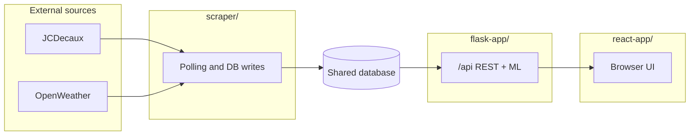

# Process

This section describes how the Dublin Bikes system was organised and which tools were adopted. It is derived from the **flask-app**, **react-app**, and **scraper** repositories (READMEs, `Jenkinsfile`s, Dockerfiles, and test layout), and from the repository root **`process.md`** (end-to-end workflow, API surface, and frontend–backend wiring). **Per-sprint narratives, burndown charts, sprint reviews, and retrospectives** should be filled from your team’s product and sprint backlog tooling (URLs belong on the report title page) and from the [sprint retrospective form](https://forms.gle/jeAqgXarzr7R6YBU8) (max 250 words per retrospective, submitted at the end of each sprint).

---

## 1. Project organisation and repositories

The work is split across **three separate Git repositories**, each with its own CI pipeline:

| Repository | Role |
|------------|------|
| **flask-app** | REST API backend: authentication (JWT), stations and availability, weather and predictions (Random Forest), journey planning, AI chat (SSE). **Owns database schema** via Flask-Migrate; documents shared MySQL usage with the scraper. |
| **react-app** | Single-page frontend (React 19, TypeScript, Vite 7, Tailwind CSS 4, React Router). Consumes the Flask API; production image serves static assets with **nginx**. |
| **scraper** | Long-running data ingest: JCDecaux station and availability polling, plus OpenWeather forecast ingest (`fetch_weather.py`), writing to the same database tables created by flask-app migrations. |

This separation keeps **API contracts**, **UI delivery**, and **batch ingestion** independent while sharing one logical database.

---

## 2. Local development and configuration

### 2.1 Backend (flask-app)

- **Python:** Conda environments are documented (e.g. Python 3.12 aligned with Docker). Dependencies: `requirements.txt`. Entry points: `run.py` (development), `wsgi.py` (Gunicorn / Docker).
- **Configuration:** Mandatory variables include `DATABASE_URL`, JWT secrets, and `OPENWEATHER_API_KEY` (`config.py` / `.env.example`). Optional keys cover Google Maps, Aliyun (chat), and mail.
- **Database:** **Migrations must be run in flask-app first** (`flask db upgrade`) before the scraper or API rely on tables such as `station`, `availability`, `weather_forecast`, etc.

### 2.2 Frontend (react-app)

- **Node.js** (≥18 recommended in README), **npm** with `npm install`, `npm run dev` (Vite dev server, `--host` enabled for LAN access), `npm run build`, `npm run preview`.
- **Environment:** `.env` from `.env.example` for API base URL and keys as needed.

### 2.3 Scraper

- **Python** (e.g. 3.11 in README example), `pip install -r requirements.txt`, `.env` with `DATABASE_URL`, JCDecaux contract/key, scrape intervals (`SCRAPE_INTERVAL_SECONDS`, `RETRY_INTERVAL_SECONDS`, `WEATHER_SCRAPE_INTERVAL_SECONDS`).
- **Runtime:** `main_scraper.py` runs a continuous loop plus a background thread for `fetch_weather_and_store()`; Docker images default to that entrypoint.

### 2.4 Integration contract

- **Shared Docker network:** Documentation and Jenkins deploy scripts use a Docker network named **`flask-app`** so containers resolve each other (e.g. frontend `BACKEND_HOST=flask-app`).
- **EC2 host prep** (documented for Flask): create the network and directories such as `/opt/flask-app` for production `.env` files before automated deploy.

---

## 3. Detailed system workflow (merged from `process.md`)

> **Note:** There is no top-level `README.md` at the repository root; course and documentation pointers live in `docs/README.md`. Per-subsystem guides: `flask-app/README.md`, `react-app/README.md`, `scraper/README.md`.

### 3.1 Overview

The system is a **bike-sharing data and travel-assistance** stack with three layers:

1. **Data collection (`scraper/`)** — A standalone Python process periodically calls the **JCDecaux** station API and (optionally) **OpenWeatherMap**, writing `Station` / `Availability` and `WeatherForecast` into the shared database. Ingestion is separate from the web process; table definitions come from **flask-app** migrations.

2. **Backend (`flask-app/`)** — Flask exposes REST under `/api/...`: stations and availability, **ML predictions**, **weather** (read from DB), **journey planning** (Google Maps), **user registration/login/JWT**, and **Qwen chat** (including SSE). The API reads the same database; the prediction model is preloaded at startup.

3. **Frontend (`react-app/`)** — Vite + React calls the same-origin **`/api`** path (Vite proxies to Flask in development). The map view combines stations, predictions, weather, and routing; chat uses streaming; auth uses axios interceptors and token refresh.

**Closed data path:** external APIs → scraper persists → Flask reads DB / inference / journey logic → React renders and interacts. Paths and filenames below match the source tree.

*Mermaid diagrams require a renderer that supports them (e.g. GitHub preview, VS Code / Cursor with a Mermaid extension).*

**Integration prerequisite (as in code):** **`DATABASE_URL` for `scraper` and `flask-app` must point at the same database** (schema owned by backend migrations). Locally, Flask typically runs `python run.py` on port **5000**; `react-app` Vite proxies `/api` to `127.0.0.1:5000`. In production, a reverse proxy forwards same-origin `/api` to Flask, matching frontend `API_BASE_URL` as an empty string.

### 3.2 Data collection (`scraper/`)

Ingestion lives under `scraper/`, decoupled from Flask. Schema is maintained by **flask-app** migrations; the scraper writes via SQLAlchemy only (see `scraper/README.md` and `main_scraper.py` comments).

#### Stations and availability (JCDecaux)

- **Config** (`config.py`): loads from `.env` — `DATABASE_URL` (required), `JCDECAUX_BASE_URL` (default `https://api.jcdecaux.com/vls/v1/stations`), `JCDECAUX_CONTRACT`, `JCDECAUX_API_KEY`, poll interval `SCRAPE_INTERVAL_SECONDS` (default 300), retry interval `RETRY_INTERVAL_SECONDS` (default 60).
- **HTTP** (`fetch_stations.py`): `urllib.request` with `contract` / `apiKey` query params; JSON response; when run as a script, can write `OUTPUT_JSON` (default `stations.json`).
- **Main loop** (`main_scraper.py`): main thread loops `scrape_stations()`, then `time.sleep(SCRAPE_INTERVAL_SECONDS)`; on error, prints and waits `RETRY_INTERVAL_SECONDS`.
- **Parse and persist** (`scrape_stations()`): response may be an array or dict with `stations` / `data`; for each row: insert `Station` if `number` is new (static fields: name, coordinates, `banking`/`bonus`, `bike_stands`, etc.); always append `Availability` (bikes/docks, `status`, `last_update`, `timestamp` derived from `last_update`, `requested_at` = scrape time UTC). `SessionLocal` from `database.py` (`create_engine(..., pool_pre_ping=True)` + `sessionmaker`); models in `models.py` (`Station`, `Availability`).

#### Weather (OpenWeatherMap)

- **Config:** if `OPENWEATHER_API_KEY` is unset, weather fetch is skipped (`fetch_weather.py` returns early). `WEATHER_CITY` (default `Dublin,IE`); Geocoding / One Call / Forecast URLs can be overridden via env.
- **Logic** (`fetch_weather_and_store()`): Geocoding for lat/lon; prefer One Call 3.0 (`hourly`); on 401, fall back to 2.5 `forecast` `list`. Hourly rows (up to ~48h ahead) go to `weather_forecast` (`models_weather.py`: `WeatherForecast`), upsert by `forecast_time`; delete rows older than the current UTC hour boundary.
- **Concurrency:** `main_scraper.py` runs a **daemon thread** `weather_worker()` calling `fetch_weather_and_store()` then `time.sleep(WEATHER_SCRAPE_INTERVAL_SECONDS)` (default 3600); errors use `RETRY_INTERVAL_SECONDS` retry.

#### Entry points

| Command | Behaviour |
|---------|-----------|
| `python main_scraper.py` | Station polling + weather thread (default Docker command) |
| `python fetch_stations.py` | One-off fetch; optional JSON file; no long-running loop |
| `python fetch_weather.py` | One-off `fetch_weather_and_store()` |

### 3.3 Backend processing (`flask-app/`)

The app is built with `create_app()` (`app/__init__.py`): SQLAlchemy (`extensions.db`), Flask-Migrate, Flask-Mail; config includes DB URI, mail, and **Aliyun Qwen** `ALIYUN_API_KEY`. On startup, `prediction_service._load_model()` preloads the bike-availability model (logs on failure, does not block). Artefacts load from **`machine_learning/`** (e.g. `bike_availability_model.pkl`, `model_features.pkl`; see `app/services/prediction_service.py`).

Blueprints are registered in `app/api/__init__.py` (`register_blueprints()`). REST paths use `/api/...`; most responses follow `{ "code", "msg", "data" }` (streaming chat excepted).

#### `/api/stations` (`station_routes.py` + `station_service` / `prediction_service`)

| Method | Path | Role |
|--------|------|------|
| GET | `/` | List all stations (`StationVO`) |
| GET | `/status` | Latest availability per station (`AvailabilityVO`) |
| GET | `/<number>/availability` | Availability series for ~last day; 404 if station missing |
| GET | `/<number>/prediction` | Predicted available bikes; `PredictionError` → 400, other errors → 500 |

#### `/api/users` (`user_routes.py` + `user_service`)

Pydantic DTOs for JSON. Main routes: `POST /register`; `POST /send-verification-code` (`identifier` = username or email); `POST /activate`, `POST /activate-by-token`; `POST /login` returns `access_token` / `refresh_token` (`AuthTokenVO`); `POST /refresh`; `POST /logout` (Bearer; server bumps `token_version`); `GET /me` (Bearer). Business codes include `40901`–`40903`, `40101`, etc.

#### `/api/weather` (`weather_routes.py` + `weather_service`)

| GET | `""` (i.e. `/api/weather`) | Reads `WeatherForecast` from DB — up to **6** rows from current hour, shaped like One Call `current` + `hourly`; `WeatherAPIError` 404 if empty |

Data is written by the scraper (see §3.2).

#### `/api/journey` (`journey_routes.py` + `journey_service`)

| POST | `/plan` | Requires `GOOGLE_MAPS_API_KEY` for `googlemaps.Client`. Body: either **addresses** `start_address` + `end_address` (geocoded), or **coordinates** `start`/`end` with `lat`/`lon`. Calls `find_best_route()` (stations, availability, Distance Matrix, etc.); returns `route_info` and `search_context.start_resolved` / `end_resolved`; 404 if no suitable stations; Google errors mapped to 502/504, etc. |

#### `/api/chat` (`chat_routes.py` + `chat_service`)

All require **`Authorization: Bearer <access_token>`** (`verify_access_token`).

| Method | Path | Role |
|--------|------|------|
| POST | `/` | JSON: `message` (required), `chat_id` (optional); `generate_chat_response` → `reply` |
| POST | `/stream` | Same body; SSE (`text/event-stream`), `generate_chat_stream` |
| GET | `/sessions` | User’s sessions (`Session`, ordered by `updated_at` desc) |
| GET | `/sessions/<session_id>/messages` | History; 404 if missing or forbidden |

Some errors return `{ "error": "..." }` (401), unlike the `code`-style JSON elsewhere — the frontend handles both.

### 3.4 Frontend interaction (`react-app/`)

Vite + React Router. `src/config.ts` sets `API_BASE_URL` to `''` so requests use same-origin **`/api`**; `vite.config.ts` proxies `/api` to `http://127.0.0.1:5000`; production needs nginx (or similar) to reverse-proxy `/api` to Flask.

#### HTTP client and auth (`src/api/request.ts`, `token.ts`, `client.ts`)

- Global **axios** instance (`request`), empty `baseURL`, **15s** timeout; response interceptor unwraps `{ code, msg, data }` (treats `code` **0 or 1** as success and replaces `response.data` with inner `data`).
- Request interceptor: `resolveAccessToken()` — prefer `access_token`, else refresh via `POST /api/users/refresh`; sets **`Authorization: Bearer`** and legacy **`token`** header.
- **401/403** on non-exempt paths: one refresh retry; on failure, `clearAuthTokens()`, toast, `replaceState` to `/login`.
- **Exempt paths:** `/api/users/login|register|send-verification-code|activate|activate-by-token` and **`GET /api/stations/`** (list).
- Tokens in **`sessionStorage` or `localStorage`** (`token.ts`; session preferred, “remember me” chooses persistence).

#### API modules and pages

| Area | Files | Backend paths | Main UI |
|------|-------|---------------|---------|
| User | `auth.ts`, `user.ts` | login/register/send-verification-code/activate/activate-by-token; `GET /api/users/me`; `POST /api/users/logout` | Login, register, verify, activate; **Profile** |
| Stations | `station.ts` | `GET /api/stations/`, `/status`, `/:number/availability`, `/:number/prediction` | **Maps**: markers, status, history, Recharts (some calls manually unwrap nested `data`) |
| Journey | `journey.ts` | `POST /api/journey/plan` | **Maps**: route from coordinates or addresses |
| Weather | `weather.ts` | `GET /api/weather` | **Maps** / **Weather** widget |
| Chat | `chat.ts` | `POST /api/chat/stream` (SSE); `GET /api/chat/sessions`, `/sessions/:id/messages` | **Chat**: `@microsoft/fetch-event-source`, Bearer/`token`, refresh + one retry on 401/403; parses JSON `{"content":...}` or `[DONE]` |

#### Routing and maps (`src/router/index.tsx`, `pages/Maps/Maps.tsx`)

Routes include Home, Register, VerifyEmail, `activate/:token`, Login, News, **Chat**, **Profile**, **Maps**. **News** (`pages/News/News.tsx`) is a placeholder and **does not call the backend**. **Google Maps JS** is loaded by injecting `maps.googleapis.com/maps/api/js` (browser SDK key in frontend env; distinct from Flask `GOOGLE_MAPS_API_KEY` for server-side Google APIs).

#### Alignment with backend

Station/user APIs use `{ code, msg, data }`; chat streaming and some auth errors follow the backend’s mixed styles — handled in `request` vs `chatStreamAPI` as documented in §3.3.

### 3.5 Recommended local integration order

Aligned with each subdirectory `README.md`: **schema first, then ingest, then API, then UI.**

1. **Database:** create an empty DB; point **`DATABASE_URL`** in both `flask-app` and `scraper` `.env` files at the same instance.
2. **Migrations (flask-app only):** `flask --app app:create_app db upgrade` (or project-equivalent). **Run before the scraper** so tables exist.
3. **Flask:** `python run.py` → `http://127.0.0.1:5000`.
4. **(Optional) Scraper:** configure JCDecaux etc., run `python main_scraper.py`. Without it, some endpoints may return empty data or 404 depending on code paths.
5. **Frontend:** `npm run dev` in `react-app/`; Vite proxies `/api` to port 5000 as in §3.1.

For full command lists and env tables see **`flask-app/README.md`**, **`react-app/README.md`**, **`scraper/README.md`**.

---

## 4. Quality assurance and testing

### 4.1 flask-app

- **Framework:** **pytest** with **JUnit XML** output in CI (`pytest tests/ --junitxml=test-reports/pytest.xml`).
- **Scope:** Tests live under `tests/`; README states roughly **97%** statement coverage on `app` when run with `pytest --cov=app` (figures change with code).
- **Strategy:** SQLite in-memory DB per test run; external services (Google Maps, LLM, mail) **mocked** in `conftest.py` and test modules.

### 4.2 react-app

- **Static checks in CI:** `npm run lint` (ESLint) and `npx tsc --noEmit` (TypeScript), executed in the Jenkins pipeline before image build.

### 4.3 scraper

- **CI:** `py_compile` on main Python modules after installing dependencies (syntax gate before Docker build).

---

## 5. Continuous integration and delivery

All three projects use **Jenkins Pipeline** with a **Kubernetes** agent (dedicated pod YAML per repo: Python or Node builder + **Docker CLI** sidecar with socket mount).

### 5.1 flask-app (`Jenkinsfile`)

Typical stage order:

1. Checkout SCM  
2. **Python syntax check** — venv, `pip install -r requirements.txt`, `py_compile` on `config.py`, `run.py`, `wsgi.py`, and `app/**/*.py`  
3. **Tests** — install `pytest` / `pytest-cov`, run `pytest tests/`, publish JUnit  
4. **Download ML artefacts** — Hugging Face Hub: `bike_availability_model.pkl` and `model_features.pkl` into `machine_learning/` (credentials: `huggingface-token`)  
5. **Docker build & push** — optional via `PUSH_IMAGE` / `DEPLOY_TO_EC2`  
6. **Deploy to EC2** — only when branch is **`main`** and the build is **not** a pull request: SSH to host from `aws-ec2` credential, upload `flask-prod.env`, `docker pull`, `docker run` on network `flask-app` with `--env-file` (default `/opt/flask-app/.env`)

Other Jenkins credentials referenced: Docker Hub (`docker-hub-credentials`), SSH key (`server-ssh-key`), image name default `kaiwenyao/flask-app`.

### 5.2 react-app (`Jenkinsfile`)

1. Checkout  
2. **`npm ci`**, `npm run lint`, `npx tsc --noEmit`  
3. **Docker build** with **BuildKit secret** mounting `react-prod.env` as `/app/.env` during `npm run build` (no secrets baked into layers)  
4. Push when `PUSH_IMAGE` or branch is **`main`**  
5. **EC2 deploy** — same `main` + not-PR rule: upload env, run container on `flask-app` network with `BACKEND_HOST` / `BACKEND_PORT` (defaults `flask-app`, `5000`)

Image default: `kaiwenyao/react-app`; container name default `react-app`.

### 5.3 scraper (`Jenkinsfile`)

1. Checkout  
2. Python `py_compile` on core modules  
3. Build and push Docker image (`kaiwenyao/scraper` by default)  
4. Optional EC2 deploy: `scraper.env` at `/opt/scraper/.env`, container `scraper`, network `flask-app`

---

## 6. Runtime architecture on the server

- **Flask** serves the API (Gunicorn with threaded workers in Docker/`entrypoint.sh`).  
- **React** production bundle is served by **nginx** inside the frontend image; API calls go to the backend host on the shared network.  
- **Scraper** container runs `main_scraper.py` with restart policy **unless-stopped** (as in README examples).

Together, this gives a **containerised, repeatable** path from commit to EC2, with **secrets** supplied via Jenkins credentials and on-host `.env` files rather than committed to Git.

---

## 7. Sprints (to complete from team records)

The module requires **for each sprint**: narrative of implemented features and design decisions, a **burndown chart**, **sprint review**, and **sprint retrospective** (max 250 words; also submitted via the official Google Form). Those artefacts depend on your **product backlog** and **sprint backlog** (link them on the title page) and are **not** stored in these three code repositories.

Use the checklist below when writing each sprint subsection:

- [ ] Features completed and key technical choices (tie to branches/PRs in GitHub if helpful).  
- [ ] Burndown chart (export from your agile tool).  
- [ ] Sprint review summary (demo outcomes, stakeholder feedback if any).  
- [ ] Retrospective (≤250 words) + form submission confirmation.

---

## 8. Summary

Development was organised around **three repos**, a **shared MySQL schema** owned by Flask migrations, **pytest-heavy** backend testing, **ESLint/TypeScript** gates on the frontend, and **Jenkins + Docker + EC2** for integration and deployment. The process is **evidence-based**: build logs, JUnit from pytest, and pipeline stages in each `Jenkinsfile` document how changes are validated before release. The **detailed request/response and scraper behaviour** in §3 ties these repositories together for implementation and local debugging.
