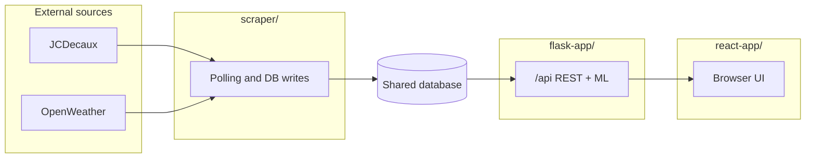

# Process

This section describes how the Dublin Bikes system was organised and which tools were adopted. It is derived from the **flask-app**, **react-app**, and **scraper** repositories (READMEs, `Jenkinsfile`s, Dockerfiles, and test layout), and from the repository root **`process.md`** (end-to-end workflow, API surface, and frontend–backend wiring). **Per-sprint narratives, burndown charts, sprint reviews, and retrospectives** should be filled from your team’s product and sprint backlog tooling (URLs belong on the report title page) and from the [sprint retrospective form](https://forms.gle/jeAqgXarzr7R6YBU8) (max 250 words per retrospective, submitted at the end of each sprint).

---

## 1. Project organisation and repositories

The work is split across **three separate Git repositories**, each with its own CI pipeline:

| Repository | Role |
|------------|------|
| **flask-app** | REST API backend: authentication (JWT), stations and availability, weather and predictions (Random Forest), journey planning, AI chat (SSE). **Owns database schema** via Flask-Migrate; documents shared MySQL usage with the scraper. |
| **react-app** | Single-page frontend (React 19, TypeScript, Vite 7, Tailwind CSS 4, React Router). Consumes the Flask API; production image serves static assets with **nginx**. |
| **scraper** | Long-running data ingest: JCDecaux station and availability polling, plus OpenWeather forecast ingest (`fetch_weather.py`), writing to the same database tables created by flask-app migrations. |

This separation keeps **API contracts**, **UI delivery**, and **batch ingestion** independent while sharing one logical database.

---

## 2. Local development and configuration

### 2.1 Backend (flask-app)

- **Python:** Conda environments are documented (e.g. Python 3.12 aligned with Docker). Dependencies: `requirements.txt`. Entry points: `run.py` (development), `wsgi.py` (Gunicorn / Docker).
- **Configuration:** Mandatory variables include `DATABASE_URL`, JWT secrets, and `OPENWEATHER_API_KEY` (`config.py` / `.env.example`). Optional keys cover Google Maps, Aliyun (chat), and mail.
- **Database:** **Migrations must be run in flask-app first** (`flask db upgrade`) before the scraper or API rely on tables such as `station`, `availability`, `weather_forecast`, etc.

### 2.2 Frontend (react-app)

- **Node.js** (≥18 recommended in README), **npm** with `npm install`, `npm run dev` (Vite dev server, `--host` enabled for LAN access), `npm run build`, `npm run preview`.
- **Environment:** `.env` from `.env.example` for API base URL and keys as needed.

### 2.3 Scraper

- **Python** (e.g. 3.11 in README example), `pip install -r requirements.txt`, `.env` with `DATABASE_URL`, JCDecaux contract/key, scrape intervals (`SCRAPE_INTERVAL_SECONDS`, `RETRY_INTERVAL_SECONDS`, `WEATHER_SCRAPE_INTERVAL_SECONDS`).
- **Runtime:** `main_scraper.py` runs a continuous loop plus a background thread for `fetch_weather_and_store()`; Docker images default to that entrypoint.

### 2.4 Integration contract

- **Shared Docker network:** Documentation and Jenkins deploy scripts use a Docker network named **`flask-app`** so containers resolve each other (e.g. frontend `BACKEND_HOST=flask-app`).
- **EC2 host prep** (documented for Flask): create the network and directories such as `/opt/flask-app` for production `.env` files before automated deploy.

---

## 3. Detailed system workflow (merged from `process.md`)

> **Note:** There is no top-level `README.md` at the repository root; course and documentation pointers live in `docs/README.md`. Per-subsystem guides: `flask-app/README.md`, `react-app/README.md`, `scraper/README.md`.

### 3.1 Overview

The system is a **bike-sharing data and travel-assistance** stack with three layers:

1. **Data collection (`scraper/`)** — A standalone Python process periodically calls the **JCDecaux** station API and (optionally) **OpenWeatherMap**, writing `Station` / `Availability` and `WeatherForecast` into the shared database. Ingestion is separate from the web process; table definitions come from **flask-app** migrations.

2. **Backend (`flask-app/`)** — Flask exposes REST under `/api/...`: stations and availability, **ML predictions**, **weather** (read from DB), **journey planning** (Google Maps), **user registration/login/JWT**, and **Qwen chat** (including SSE). The API reads the same database; the prediction model is preloaded at startup.

3. **Frontend (`react-app/`)** — Vite + React calls the same-origin **`/api`** path (Vite proxies to Flask in development). The map view combines stations, predictions, weather, and routing; chat uses streaming; auth uses axios interceptors and token refresh.

**Closed data path:** external APIs → scraper persists → Flask reads DB / inference / journey logic → React renders and interacts. Paths and filenames below match the source tree.

*Mermaid diagrams require a renderer that supports them (e.g. GitHub preview, VS Code / Cursor with a Mermaid extension).*

**Integration prerequisite (as in code):** **`DATABASE_URL` for `scraper` and `flask-app` must point at the same database** (schema owned by backend migrations). Locally, Flask typically runs `python run.py` on port **5000**; `react-app` Vite proxies `/api` to `127.0.0.1:5000`. In production, a reverse proxy forwards same-origin `/api` to Flask, matching frontend `API_BASE_URL` as an empty string.

### 3.2 Data collection (`scraper/`)

Ingestion lives under `scraper/`, decoupled from Flask. Schema is maintained by **flask-app** migrations; the scraper writes via SQLAlchemy only (see `scraper/README.md` and `main_scraper.py` comments).

#### Stations and availability (JCDecaux)

- **Config** (`config.py`): loads from `.env` — `DATABASE_URL` (required), `JCDECAUX_BASE_URL` (default `https://api.jcdecaux.com/vls/v1/stations`), `JCDECAUX_CONTRACT`, `JCDECAUX_API_KEY`, poll interval `SCRAPE_INTERVAL_SECONDS` (default 300), retry interval `RETRY_INTERVAL_SECONDS` (default 60).
- **HTTP** (`fetch_stations.py`): `urllib.request` with `contract` / `apiKey` query params; JSON response; when run as a script, can write `OUTPUT_JSON` (default `stations.json`).
- **Main loop** (`main_scraper.py`): main thread loops `scrape_stations()`, then `time.sleep(SCRAPE_INTERVAL_SECONDS)`; on error, prints and waits `RETRY_INTERVAL_SECONDS`.
- **Parse and persist** (`scrape_stations()`): response may be an array or dict with `stations` / `data`; for each row: insert `Station` if `number` is new (static fields: name, coordinates, `banking`/`bonus`, `bike_stands`, etc.); always append `Availability` (bikes/docks, `status`, `last_update`, `timestamp` derived from `last_update`, `requested_at` = scrape time UTC). `SessionLocal` from `database.py` (`create_engine(..., pool_pre_ping=True)` + `sessionmaker`); models in `models.py` (`Station`, `Availability`).

#### Weather (OpenWeatherMap)

- **Config:** if `OPENWEATHER_API_KEY` is unset, weather fetch is skipped (`fetch_weather.py` returns early). `WEATHER_CITY` (default `Dublin,IE`); Geocoding / One Call / Forecast URLs can be overridden via env.
- **Logic** (`fetch_weather_and_store()`): Geocoding for lat/lon; prefer One Call 3.0 (`hourly`); on 401, fall back to 2.5 `forecast` `list`. Hourly rows (up to ~48h ahead) go to `weather_forecast` (`models_weather.py`: `WeatherForecast`), upsert by `forecast_time`; delete rows older than the current UTC hour boundary.
- **Concurrency:** `main_scraper.py` runs a **daemon thread** `weather_worker()` calling `fetch_weather_and_store()` then `time.sleep(WEATHER_SCRAPE_INTERVAL_SECONDS)` (default 3600); errors use `RETRY_INTERVAL_SECONDS` retry.

#### Entry points

| Command | Behaviour |
|---------|-----------|
| `python main_scraper.py` | Station polling + weather thread (default Docker command) |
| `python fetch_stations.py` | One-off fetch; optional JSON file; no long-running loop |
| `python fetch_weather.py` | One-off `fetch_weather_and_store()` |

### 3.3 Backend processing (`flask-app/`)

The app is built with `create_app()` (`app/__init__.py`): SQLAlchemy (`extensions.db`), Flask-Migrate, Flask-Mail; config includes DB URI, mail, and **Aliyun Qwen** `ALIYUN_API_KEY`. On startup, `prediction_service._load_model()` preloads the bike-availability model (logs on failure, does not block). Artefacts load from **`machine_learning/`** (e.g. `bike_availability_model.pkl`, `model_features.pkl`; see `app/services/prediction_service.py`).

Blueprints are registered in `app/api/__init__.py` (`register_blueprints()`). REST paths use `/api/...`; most responses follow `{ "code", "msg", "data" }` (streaming chat excepted).

#### `/api/stations` (`station_routes.py` + `station_service` / `prediction_service`)

| Method | Path | Role |
|--------|------|------|
| GET | `/` | List all stations (`StationVO`) |
| GET | `/status` | Latest availability per station (`AvailabilityVO`) |
| GET | `/<number>/availability` | Availability series for ~last day; 404 if station missing |
| GET | `/<number>/prediction` | Predicted available bikes; `PredictionError` → 400, other errors → 500 |

#### `/api/users` (`user_routes.py` + `user_service`)

Pydantic DTOs for JSON. Main routes: `POST /register`; `POST /send-verification-code` (`identifier` = username or email); `POST /activate`, `POST /activate-by-token`; `POST /login` returns `access_token` / `refresh_token` (`AuthTokenVO`); `POST /refresh`; `POST /logout` (Bearer; server bumps `token_version`); `GET /me` (Bearer). Business codes: `40001` for `ValidationError` (invalid input on any user endpoint); `40901`–`40903` for conflict errors; `40101` for auth errors (including login with disabled account, which returns HTTP 403 with body code `40101`).

#### `/api/weather` (`weather_routes.py` + `weather_service`)

| GET | `""` (i.e. `/api/weather`) | Reads `WeatherForecast` from DB — up to **6** rows from current hour, shaped like One Call `current` + `hourly`. Errors return `{"code": 50001, "msg": ..., "data": null}` with HTTP 404 (empty DB) or HTTP 500 (unexpected failure); 404 if empty |

Data is written by the scraper (see §3.2).

#### `/api/journey` (`journey_routes.py` + `journey_service`)

| POST | `/plan` | Requires `GOOGLE_MAPS_API_KEY` for `googlemaps.Client`. Body: either **addresses** `start_address` + `end_address` (geocoded), or **coordinates** `start`/`end` with `lat`/`lon`. Calls `find_best_route()` (stations, availability, Distance Matrix, etc.); returns `route_info` and `search_context.start_resolved` / `end_resolved`. Error codes: `400` for validation errors (missing/invalid fields, no suitable stations); `404` if no suitable stations; `500` for unexpected failures; Google errors mapped to 502/504. |

#### `/api/chat` (`chat_routes.py` + `chat_service`)

All require **`Authorization: Bearer <access_token>`** (`verify_access_token`).

| Method | Path | Role |
|--------|------|------|
| POST | `/` | JSON: `message` (required), `chat_id` (optional); `generate_chat_response` → `reply` |
| POST | `/stream` | Same body; SSE (`text/event-stream`), `generate_chat_stream` |
| GET | `/sessions` | User’s sessions (`Session`, ordered by `updated_at` desc) |
| GET | `/sessions/<session_id>/messages` | History; 404 with body `{"code": 404, "msg": "session not found", "data": null}` if missing or forbidden |

`POST /` and `POST /stream` return `{ "error": "..." }` for HTTP 401 (auth) and HTTP 400 (validation errors: invalid JSON body or missing `message` field). Unexpected failures in non-streaming chat (`POST /`) return `{"code": 50000, "msg": ..., "data": null}` with HTTP 500. The frontend handles both the `code`-style and `error`-style JSON formats.

### 3.4 Frontend interaction (`react-app/`)

Vite + React Router. `src/config.ts` sets `API_BASE_URL` to `''` so requests use same-origin **`/api`**; `vite.config.ts` proxies `/api` to `http://127.0.0.1:5000`; production needs nginx (or similar) to reverse-proxy `/api` to Flask.

#### HTTP client and auth (`src/api/request.ts`, `token.ts`, `client.ts`)

- Global **axios** instance (`request`), empty `baseURL`, **15s** timeout; response interceptor unwraps `{ code, msg, data }` (treats `code` **0 or 1** as success and replaces `response.data` with inner `data`).
- Request interceptor: `resolveAccessToken()` — prefer `access_token`, else refresh via `POST /api/users/refresh`; sets **`Authorization: Bearer`** and legacy **`token`** header.
- **401/403** on non-exempt paths: one refresh retry; on failure, `clearAuthTokens()`, toast, `replaceState` to `/login`.
- **Exempt paths:** `/api/users/login|register|send-verification-code|activate|activate-by-token` and **`GET /api/stations/`** (list).
- Tokens in **`sessionStorage` or `localStorage`** (`token.ts`; session preferred, “remember me” chooses persistence).

#### API modules and pages

| Area | Files | Backend paths | Main UI |
|------|-------|---------------|---------|
| User | `auth.ts`, `user.ts` | login/register/send-verification-code/activate/activate-by-token; `GET /api/users/me`; `POST /api/users/logout` | Login, register, verify, activate; **Profile** |
| Stations | `station.ts` | `GET /api/stations/`, `/status`, `/:number/availability`, `/:number/prediction` | **Maps**: markers, status, history, Recharts (some calls manually unwrap nested `data`) |
| Journey | `journey.ts` | `POST /api/journey/plan` | **Maps**: route from coordinates or addresses |
| Weather | `weather.ts` | `GET /api/weather` | **Maps** / **Weather** widget |
| Chat | `chat.ts` | `POST /api/chat/stream` (SSE); `GET /api/chat/sessions`, `/sessions/:id/messages` | **Chat**: `@microsoft/fetch-event-source`, Bearer/`token`, refresh + one retry on 401/403; parses JSON `{"content":...}` or `[DONE]` |

#### Routing and maps (`src/router/index.tsx`, `pages/Maps/Maps.tsx`)

Routes include Home, Register, VerifyEmail, `activate/:token`, Login, News, **Chat**, **Profile**, **Maps**. **News** (`pages/News/News.tsx`) is a placeholder and **does not call the backend**. **Google Maps JS** is loaded by injecting `maps.googleapis.com/maps/api/js` (browser SDK key in frontend env; distinct from Flask `GOOGLE_MAPS_API_KEY` for server-side Google APIs).

#### Alignment with backend

Station/user APIs use `{ code, msg, data }`; chat streaming and some auth errors follow the backend’s mixed styles — handled in `request` vs `chatStreamAPI` as documented in §3.3.

### 3.5 Recommended local integration order

Aligned with each subdirectory `README.md`: **schema first, then ingest, then API, then UI.**

1. **Database:** create an empty DB; point **`DATABASE_URL`** in both `flask-app` and `scraper` `.env` files at the same instance.
2. **Migrations (flask-app only):** `flask --app app:create_app db upgrade` (or project-equivalent). **Run before the scraper** so tables exist.
3. **Flask:** `python run.py` → `http://127.0.0.1:5000`.
4. **(Optional) Scraper:** configure JCDecaux etc., run `python main_scraper.py`. Without it, some endpoints may return empty data or 404 depending on code paths.
5. **Frontend:** `npm run dev` in `react-app/`; Vite proxies `/api` to port 5000 as in §3.1.

For full command lists and env tables see **`flask-app/README.md`**, **`react-app/README.md`**, **`scraper/README.md`**.

---

## 4. Quality assurance and testing

### 4.1 flask-app

- **Framework:** **pytest** with **JUnit XML** output in CI (`pytest tests/ --junitxml=test-reports/pytest.xml`).
- **Scope:** Tests live under `tests/`; README states roughly **97%** statement coverage on `app` when run with `pytest --cov=app` (figures change with code).
- **Strategy:** SQLite in-memory DB per test run; external services (Google Maps, LLM, mail) **mocked** in `conftest.py` and test modules.

### 4.2 react-app

- **Static checks in CI:** `npm run lint` (ESLint) and `npx tsc --noEmit` (TypeScript), executed in the Jenkins pipeline before image build.

### 4.3 scraper

- **CI:** `py_compile` on main Python modules after installing dependencies (syntax gate before Docker build).

---

## 5. Continuous integration and delivery

All three projects use **Jenkins Pipeline** with a **Kubernetes** agent (dedicated pod YAML per repo: Python or Node builder + **Docker CLI** sidecar with socket mount).

### 5.1 flask-app (`Jenkinsfile`)

Typical stage order:

1. Checkout SCM  
2. **Python syntax check** — venv, `pip install -r requirements.txt`, `py_compile` on `config.py`, `run.py`, `wsgi.py`, and `app/**/*.py`  
3. **Tests** — install `pytest` / `pytest-cov`, run `pytest tests/`, publish JUnit  
4. **Download ML artefacts** — Hugging Face Hub repository `ucdse/bike_availability_model`: downloads `bike_availability_model.pkl` and `model_features.pkl` into `machine_learning/` (credentials: `huggingface-token`)  
5. **Docker build & push** — optional via `PUSH_IMAGE` / `DEPLOY_TO_EC2`  
6. **Deploy to EC2** — only when branch is **`main`** and the build is **not** a pull request: SSH to host from `aws-ec2` credential, upload `flask-prod.env`, `docker pull`, `docker run` on network `flask-app` with `--env-file` (default `/opt/flask-app/.env`)

Other Jenkins credentials referenced: Docker Hub (`docker-hub-credentials`), SSH key (`server-ssh-key`), image name default `kaiwenyao/flask-app`.

### 5.2 react-app (`Jenkinsfile`)

1. Checkout  
2. **`npm ci`**, `npm run lint`, `npx tsc --noEmit`  
3. **Docker build** with **BuildKit secret** mounting `react-prod.env` as `/app/.env` during `npm run build` (no secrets baked into layers)  
4. Push when `PUSH_IMAGE` or branch is **`main`**  
5. **EC2 deploy** — same `main` + not-PR rule: upload env, run container on `flask-app` network with `BACKEND_HOST` / `BACKEND_PORT` (defaults `flask-app`, `5000`)

Image default: `kaiwenyao/react-app`; container name default `react-app`.

### 5.3 scraper (`Jenkinsfile`)

1. Checkout  
2. Python `py_compile` on core modules  
3. Build and push Docker image (`kaiwenyao/scraper` by default)  
4. Optional EC2 deploy: `scraper.env` at `/opt/scraper/.env`, container `scraper`, network `flask-app`

---

## 6. Runtime architecture on the server

- **Flask** serves the API (Gunicorn with threaded workers in Docker/`entrypoint.sh`).  
- **React** production bundle is served by **nginx** inside the frontend image; API calls go to the backend host on the shared network.  
- **Scraper** container runs `main_scraper.py` with restart policy **unless-stopped** (as in README examples).

Together, this gives a **containerised, repeatable** path from commit to EC2, with **secrets** supplied via Jenkins credentials and on-host `.env` files rather than committed to Git.

---

## 7. Sprints

### Sprint 1 — Requirements Engineering & Data Collection

**Features completed and key technical choices:**

1. **User Research**: Defined three key personas (Student, Professional, Tourist) and conducted interviews to validate assumptions. Based on interview feedback — particularly the tourist persona's fear of getting lost — we made a design decision to implement a **"Hover" feature** on map markers for quick information access, distinguishing it from the "Click" action for detailed status.

2. **Project Planning & Design**: Completed User Stories, finalised UI Mockups, and defined acceptance criteria to guide future testing.

3. **Technical Infrastructure**: Set up the MySQL database and developed Python scraping scripts for both **JCDecaux (Bikes)** and **OpenWeather (Weather)** APIs.

4. **Design Decision on Data**: Set the bike scraper interval to **5 minutes**, balancing data granularity with API rate limits and storage efficiency. Scrapers are running and populating the database.

**Burndown chart:**

*[Burndown chart available in Sprint 1 review document](sprint_review/Sprint%201%20review.docx)*

The Actual Remaining Effort line dropped below the Ideal Trend line around Day 4, indicating the team worked faster than anticipated. Zero remaining tasks were reached **2 days before the sprint deadline**, allowing time for backlog refinement and feasibility research on optional features.

**Sprint Review:**

1. **Mockup Walkthrough**: Presented Figma/PDF mockups, explaining how the UI solves persona pain points.
2. **Data Verification**: Demonstrated the live MySQL database with rows of real-time data collected over preceding days, proving scraper stability.
3. **Scope Discussion**: Since we finished early, we discussed the "Smart Journey Planner" feature, evaluating whether adding this complex feature fits within our remaining timeline. The decision on inclusion was deferred to Sprint 2 Planning.

**Retrospective (≤250 words):**

**What went well:** Team established a Discord communication channel for daily updates. User interviews validated three personas; tourist persona insights — specifically the need for intuitive navigation and weather prediction — directly influenced the decision to prioritise map interactivity. Web scraping scripts for JCDecaux and OpenWeather APIs were developed ahead of schedule and ran stably, populating the database consistently.

**What could be improved:** Some team members were initially unfamiliar with API request mechanics and local MySQL configuration, requiring extra research and troubleshooting time. However, all tasks were successfully finished in the end. Next time, the team will help each other more to solve technical issues faster.

**For next sprint:** Shift focus to Flask backend set-up and database connection; get scraped data displaying on a live map to satisfy "Real-time" acceptance criteria; conclude feasibility study on the Journey Planner feature.

---

### Sprint 2 — Backend Integration & Deployment Pipeline

**Features completed and key technical choices:**

Developed the **Flask application** as the core backend. Two main services were established: a **Weather API Service** calling the OpenWeatherMap API directly (no DB intervention), and **Station Read APIs** connecting to the MySQL database populated in Sprint 1 to return real-time station and availability rows.

The **Journey Planner** feature was included and implemented. **User Authentication** was integrated: registration and login endpoints using **JWT token creation** and **password hashing** for secure access.

Git **feature branch workflow** was defined; a **Jenkins CI/CD pipeline** was configured to enforce build checks on every branch. Automated deployment to an **AWS EC2** instance triggers on merge to `main`, using `wsgi.py` and **Gunicorn**. On the frontend, an interactive feature was implemented to display detailed station information on user trigger.

**Burndown chart:**

*[Burndown chart available in Sprint 2 review document](sprint_review/Sprint%202%20review.docx)*

The burndown chart displays a staircase pattern reflecting the project requirement to update the chart every two days. The actual remaining effort dropped below the ideal trend line by Day 4 and remained beneath it, demonstrating strong development velocity. All sprint goals were completed by Day 10.

**Sprint Review:**

1. **API Demonstration**: Showcased operational Weather and Station Read APIs returning properly formatted JSON from both live external APIs and the local MySQL database.
2. **Security & Authentication**: Demonstrated user authentication flow — JWT token generation on login, secure password hashing in the database.
3. **Pipeline Verification**: Live demo of CI/CD: code push → Jenkins build → automated deployment to EC2.
4. **Scope Confirmation**: Confirmed successful inclusion and basic backend functionality of the Journey Planner endpoint.

**Retrospective (≤250 words):**

**What went well:** Transition to backend development was successful. Git feature branch workflow and Jenkins CI/CD pipeline accelerated testing and automated EC2 deployments. Early scope resolution enabled delivery of complex backend features (Journey Planner, secure User Login).

**What could be improved:** API endpoints for frontend-backend interaction lacked initial documentation, forcing frontend developers to review backend code for correct routes. The initial Journey Planner codebase missed several edge cases and had flawed route calculation logic, requiring significant refactoring time.

**For next sprint:** Develop user-facing React interfaces for Journey Planner and User Login; migrate database to Amazon RDS for performance; create detailed API documentation for frontend-backend integration.

---

### Sprint 3 — Additional Features & Frontend Implementation

**Features completed and key technical choices:**

The Flask backend application is nearly complete, returning desirable data confirmed via Postman testing.

Three additional features were implemented in essential form: **AI Chat** using the **Langchain framework** and **Aliyun API**; **chat history storage** and **LLM memory** achieved by creating new database tables. When a user logs in, chat history is displayed, allowing selection from the history list.

The **frontend** now displays available bikes and stands data on hover over station icons. Requests are sent automatically on website visit, eliminating latency when the user hovers for statistics.

A **database performance issue** was identified: the MySQL Docker container timed out on queries due to large data volume. **Resolved by migrating from EC2-hosted Docker to AWS RDS**, enabling SQL execution within acceptable timeframes.

**CI/CD** (Jenkins) kept the production application at the latest version throughout development. **Docker** and containerisation deployment technologies were maintained for a professional, normalised process.

**Burndown chart:**

*[Burndown chart available in Sprint 3 review document](sprint_review/Sprint%203%20review.docx)*

**Sprint Review:**

1. **AI Chat Features**: Successfully implemented three core AI features using Langchain and Aliyun API. Chat history storage and LLM memory demonstrated through new database tables, with history displayed upon user login.
2. **Backend Completion**: Flask backend nearing completion, confirmed via Postman testing.
3. **Frontend Data Display**: Available bike/stand data displayed on station icon hover; requests auto-sent on page load to eliminate latency.
4. **CI/CD & Deployment**: Verified continuous integration and deployment via Jenkins; Docker containerisation confirmed for normalised deployment.

**Retrospective (≤250 words):**

**What went well:** Basic feature functionality working successfully. Frontend-backend collaboration was errorless. Development and production environments were properly configured; coding and reviewing workflows operated in an ideal state.

**What could be improved:** UI/UX design could be improved with more professional tools and a better colour scheme. **The API key** used for bike statistics and Google Maps could be leaked in the frontend console — a security concern for production. AI chat output may be interrupted if the user refreshes or closes the page during LLM streaming; a fix could persist LLM responses to the database before returning to the frontend.

**For next sprint:** Front-end beautification (better colour scheme, UI/UX); AI chat bug fix (persist output before returning to frontend); Machine Learning implementation for bike/stand availability prediction; add unit, integration, and E2E tests.

---

### Sprint 4 — Machine Learning Integration & System Finalisation

**Features completed and key technical choices:**

1. **Machine Learning Model**: Cleaned the historical dataset, handled missing values, and performed feature selection to isolate relevant predictors (weather and time). Trained, compared, and evaluated multiple ML algorithms. **Design decision**: exported the best-performing model as a `.pkl` file for fast, efficient inference without retraining overhead.

2. **Full-Stack Integration**: Built React UI components and input forms for the prediction feature. Implemented fetch logic to submit user requests to the Flask backend API, which processes data through the loaded `.pkl` model and returns a JSON response that dynamically renders prediction results on the map.

3. **Quality Assurance**: Designed and implemented comprehensive unit tests across the application, achieving **97% test coverage**.

4. **Design Decision on UI & Performance**: Refined React component visual style for UI consistency. Observed a slight **"cold start" latency** on the first prediction click (model loading into memory). Accepted this minimal initial delay as it optimises server memory; all subsequent requests are fast and seamless.

**Burndown chart:**

*[Burndown chart available in Sprint 4 review document](sprint_review/Sprint%204%20review.docx)*

Steady progression with plateaus during Days 3–5 while fine-tuning ML algorithms and resolving frontend-backend API formatting issues. A steep drop around Day 7 restored velocity; zero remaining tasks reached on Day 9 (one day before deadline). The final day was dedicated to code refactoring, UI consistency, and compiling the project report.

**Sprint Review:**

1. **Application Demonstration**: Presented the fully functional web application showcasing seamless React–Flask integration, refined UI styling, and consistent design across all pages.
2. **Machine Learning Verification**: Demonstrated live predictive feature powered by the exported `.pkl` model; explained the "cold start" latency and proved fast subsequent performance.
3. **Quality Assurance & Next Steps**: Highlighted 97% unit test coverage. Discussed strategy for the final 2-week phase: code refactoring, UI/UX beautification, and compiling the final project report.

**Retrospective (≤250 words):**

**What went well:** Successfully completed the core ML pipeline and delivered the full web application. Efficiently cleaned the dataset, isolated key predictors, and exported the best model as a `.pkl` file integrated into the Flask backend. React UI components were smoothly implemented and styled for consistency. Achieved 97% unit test coverage for a robust, reliable system.

**What could be improved:** Algorithm comparison and model fine-tuning took more time than anticipated. Resolving minor API formatting issues during frontend-backend integration required extra effort. A slight latency on first prediction click was observed (model loading into memory); all subsequent clicks are fast.

**Final Conclusion:** All core development tasks are complete. Data scraping, Flask backend, React frontend, and ML predictions are seamlessly integrated into a fully functional web application.

---

## 8. Summary

Development was organised around **three repos**, a **shared MySQL schema** owned by Flask migrations, **pytest-heavy** backend testing, **ESLint/TypeScript** gates on the frontend, and **Jenkins + Docker + EC2** for integration and deployment. The process is **evidence-based**: build logs, JUnit from pytest, and pipeline stages in each `Jenkinsfile` document how changes are validated before release. The **detailed request/response and scraper behaviour** in §3 ties these repositories together for implementation and local debugging.
